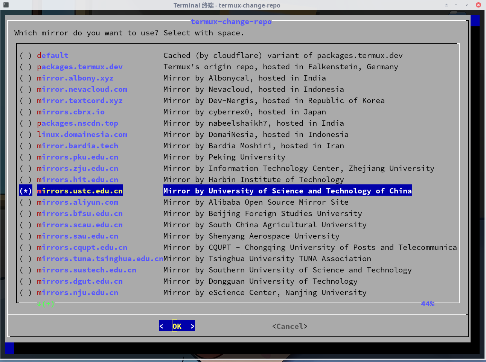
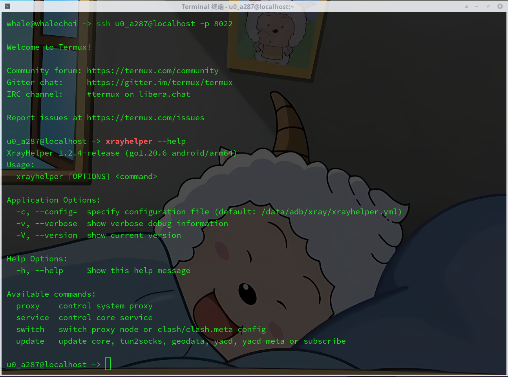
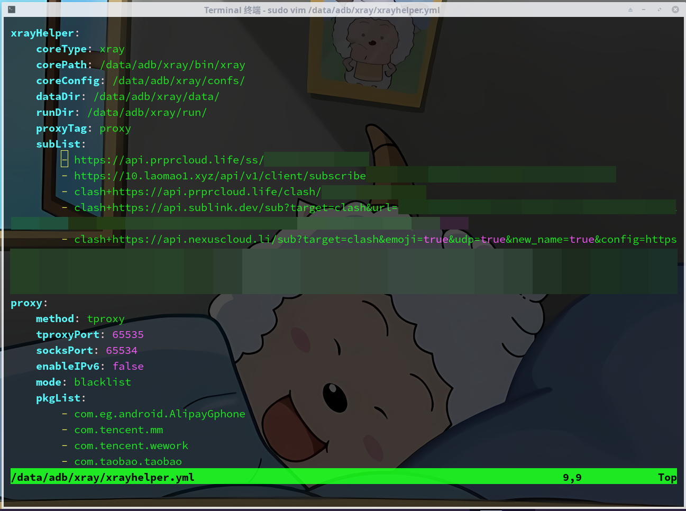
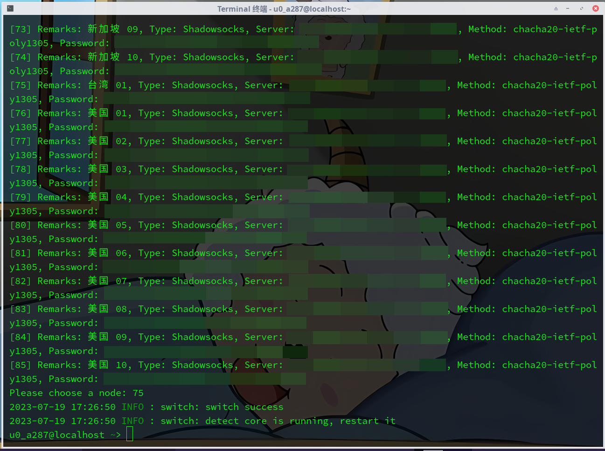
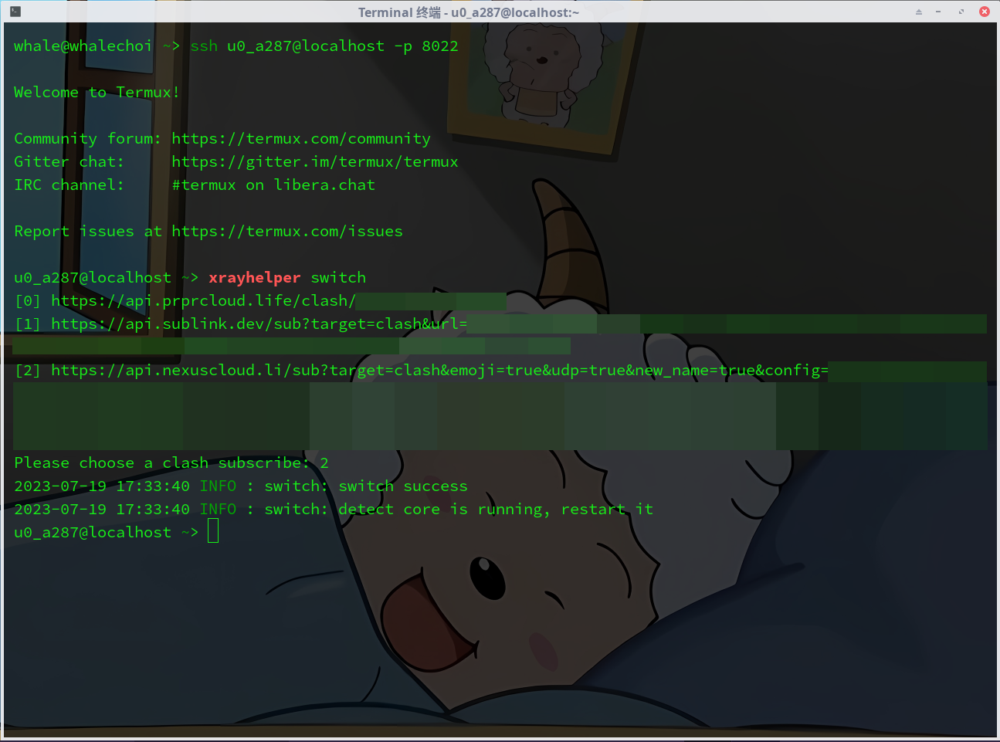
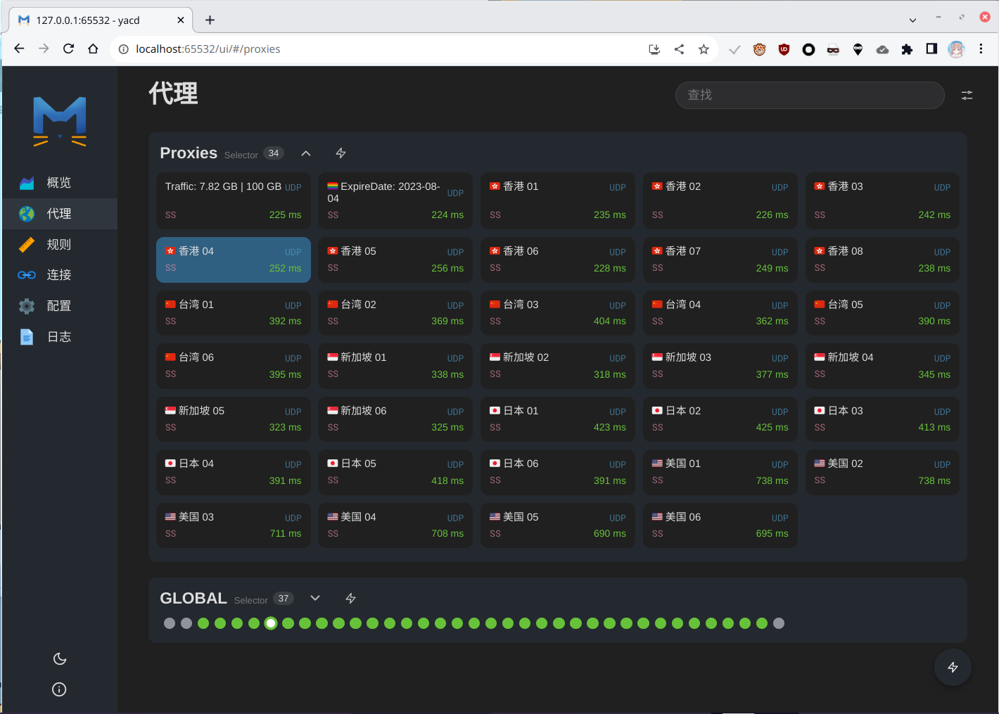

# 快速入门

首先，你需要使用 [Magisk](https://github.com/topjohnwu/Magisk) 或者 [KernelSU](https://kernelsu.org/) 将自己手机 ROOT，关于手机 ROOT 你可以在[酷安社区](https://coolapk.com/)找到很多详细教程

## 安装 Xray4Magisk

模块安装过程中，使用音量上下键进行选择。可以选择是否在线安装代理核心，强烈建议开启网络代理并选择在线安装核心。若由于某些原因需要手动安装代理核心，请将需要使用的核心二进制文件放置在 `/data/adb/xray/bin/` 目录下，并将其用户组设为 `root`、授予可执行权限，然后参照 [XrayHelper](https://github.com/Asterisk4Magisk/XrayHelper/blob/master/README_zh_CN.md) 配置 `/data/adb/xray/xrayhelper.xml`

## 配置 Termux

如果你没有安装 Termux，由于其在 Google Play 已停更，建议直接去 [Github Release](https://github.com/termux/termux-app/releases/latest) 下载并安装

1. 打开 Termux ，输入 `termux-change-repo`，更换软件源镜像，这里推荐使用中科大镜像

    

2. 使用命令 `pkg i root-repo && pkg i tsu` 安装 root-repo 和 tsu

3. 使用命令 `echo "alias xrayhelper=\"sudo /data/adb/xray/bin/xrayhelper\"" >> ~/.bashrc && source ~/.bashrc` 在 bash 配置 XrayHelper 的别名

至此，可愉快的在 Termux 使用 XrayHelper 了

## 订阅示例
在配置好 `/data/adb/xray/xrayhelper.xml` 订阅地址并使用 `xrayhelper update subscribe` 更新订阅后，可以使用 `xrayhelper switch` 切换节点或 Clash 订阅配置文件

### Xray 示例

### Clash.Meta 示例

Clash 系内核可访问 yacd/yacd-meta 面板 `http://localhost:65532/ui` 进行节点配置哦

